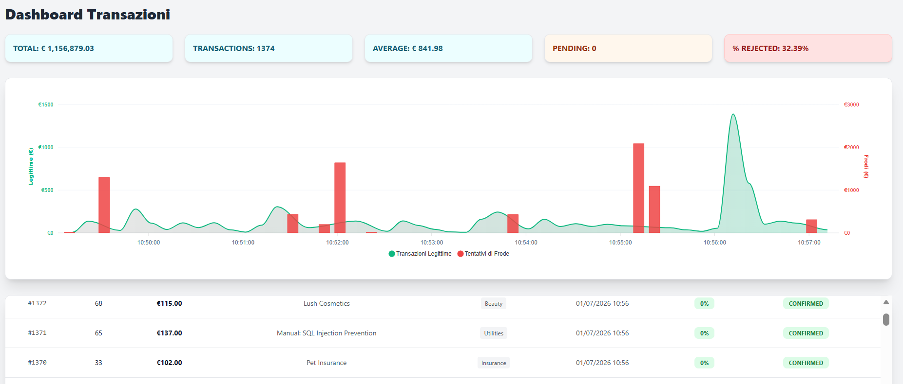

# SentinelFlow

**Real-time transaction monitoring and AI-powered fraud detection system.**

SentinelFlow is a full-stack portfolio project built to demonstrate the ability to design and integrate a complete software system across multiple technologies — from a Java backend and Angular frontend to a Python machine learning service. The system continuously generates synthetic transactions, analyzes them through a trained RandomForest model, and provides a live dashboard where each transaction can be monitored and manually overridden.

---

## Screenshots

> 

---

## Architecture

```
+-----------------+        REST / JWT        +----------------------+
|  Angular 19     | <----------------------> |  Spring Boot Backend |
|  Frontend       |                          |  Java 21             |
|  Tailwind CSS   |                          |                      |
+-----------------+                          |  - Auth (JWT)        |
                                             |  - Transaction API   |
                                             |  - Scheduler (10s)   |
                                             |  - H2 Database       |
                                             +----------+-----------+
                                                        | HTTP /predict
                                                        v
                                             +----------------------+
                                             |  FastAPI ML Service  |
                                             |  Python              |
                                             |                      |
                                             |  - RandomForest      |
                                             |  - TF-IDF (NLP)      |
                                             |  - Risk scoring      |
                                             +----------------------+
```

The system is composed of three independent services orchestrated via Docker Compose:

- **Frontend** — Angular 19 SPA with Tailwind CSS. Polls the backend every 10 seconds and renders a live transaction dashboard with ApexCharts. Supports manual status overrides per transaction.
- **Backend** — Spring Boot 3 REST API secured with JWT. A `@Scheduled` task generates synthetic transactions every 10 seconds, each analyzed by the ML service before being persisted to an H2 database. Includes a `DataInitializer` that pre-populates 500 historical transactions on first run.
- **ML Service** — FastAPI microservice exposing a `/predict` endpoint. Uses a RandomForest classifier trained on a labeled synthetic dataset, with TF-IDF vectorization of transaction descriptions as an NLP feature alongside numeric features (amount, category, hour, transaction frequency, time between transactions).

---

## Tech Stack

| Layer | Technology |
|---|---|
| Frontend | Angular 19, Tailwind CSS, ApexCharts |
| Backend | Spring Boot 3, Java 21, Spring Security, JWT |
| ML Service | FastAPI, scikit-learn (RandomForest), TF-IDF, pandas |
| Database | H2 (file-based, persistent) |
| Infrastructure | Docker, Docker Compose |

---

## Getting Started

### Prerequisites

- [Docker](https://www.docker.com/) and Docker Compose
- Or alternatively: Java 21+, Node.js 18+, Python 3.10+

---

### Option 1 — Docker Compose (recommended)

**1. Clone the repository**
```bash
git clone https://github.com/AleSigno4/SentinelFlow.git
cd SentinelFlow
```

**2. Create your `.env` file from the example**
```bash
cp .env.example .env
```
Then edit `.env` and set a secure value for `JWT_SECRET` (any random string of at least 32 characters).

**3. Start all services**
```bash
docker-compose up --build
```

**4. Open the app**
- Frontend: [http://localhost:4200](http://localhost:4200)
- Backend API: [http://localhost:8081](http://localhost:8081)
- ML Service: [http://localhost:8000](http://localhost:8000)

**Login credentials:** `admin` / `password`

---

### Option 2 — Manual local setup (without Docker)

This option requires running three separate terminals.

#### Terminal 1 — ML Service (Python)
```bash
cd backend/ai-model
pip install -r requirements.txt
```

> **Note:** The model files (`fraud_model.joblib`, `tfidf_vectorizer.joblib`) are not included in the repository. Train the model first:
> ```bash
> python train_model.py
> ```

Then start the service:
```bash
uvicorn app:app --host 0.0.0.0 --port 8000
```

#### Terminal 2 — Backend (Java)

Set the required environment variables before starting.

**macOS/Linux:**
```bash
export SPRING_DATASOURCE_URL="jdbc:h2:file:./data/sentinelflow;DB_CLOSE_ON_EXIT=FALSE"
export JWT_SECRET="your-secret-key-at-least-32-characters-long"
export AI_SERVICE_URL="http://localhost:8000"
cd backend
./mvnw spring-boot:run
```

**Windows (PowerShell):**
```powershell
$env:SPRING_DATASOURCE_URL="jdbc:h2:file:./data/sentinelflow;DB_CLOSE_ON_EXIT=FALSE"
$env:JWT_SECRET="your-secret-key-at-least-32-characters-long"
$env:AI_SERVICE_URL="http://localhost:8000"
cd backend
./mvnw spring-boot:run
```

#### Terminal 3 — Frontend (Angular)
```bash
cd frontend
npm install
ng serve
```

---

### Troubleshooting

**"JWT signature does not match" after restarting the backend**
The frontend has a token signed with a different `JWT_SECRET`. Clear `localStorage` in your browser (DevTools → Application → Local Storage → delete `token`) and log in again.

**Dashboard shows no data / stops updating**
Check that the ML Service is running on port 8000 before starting the backend. If the ML service is unreachable, transactions are still generated and saved but with a default risk score of 0 and no AI classification.

**"Database already contains data" on startup**
Expected behavior. The `DataInitializer` only generates the 500 seed transactions when the database is empty (first run). Existing data is preserved on subsequent startups.

**Port conflicts**
If ports 4200, 8081, or 8000 are already in use, update the port mappings in `docker-compose.yml` or change the port arguments for manual setup.

---

## Project Structure

```
SentinelFlow/
├── backend/
│   ├── ai-model/              # Python ML service (FastAPI)
│   │   ├── app.py             # /predict endpoint
│   │   ├── train_model.py     # Model training script
│   │   └── training_dataset.csv
│   └── src/main/java/...      # Spring Boot application
│       ├── controller/        # REST endpoints
│       ├── service/           # Business logic + scheduler
│       ├── security/          # JWT filter + util
│       ├── config/            # Security, CORS, data init
│       ├── exceptions/        # Custom exceptions + handler
│       ├── model/             # JPA entities
│       └── repository/        # Spring Data JPA
├── frontend/
│   └── src/app/
│       ├── components/        # Dashboard, Login
│       ├── core/              # Services, guards, interceptors
│       └── models/            # TypeScript interfaces
└── docker-compose.yml
```

---

## ML Model Details

The fraud detection model is a **RandomForest classifier** (`n_estimators=150`, `max_depth=12`, `class_weight='balanced'`) trained on a synthetic dataset of ~900 labeled transactions.

**Features used:**
- `amount` — transaction amount
- `category` — encoded transaction category (0-11)
- `hour` — hour of day extracted from timestamp
- `tx_count_3min` — number of transactions by the same user in the last 3 minutes (burst detection)
- `time_diff` — seconds since the user's previous transaction
- `description` — TF-IDF vectorized (100 features, English stop words removed)

The model outputs a binary prediction (`is_fraud: true/false`) which the backend combines with a rule-based risk score to determine the final transaction status.

---

## Author

Developed by **Alessandro Signori** — software developer focused on web/mobile development with a strong interest in applied AI and system integration.

[GitHub](https://github.com/AleSigno4)